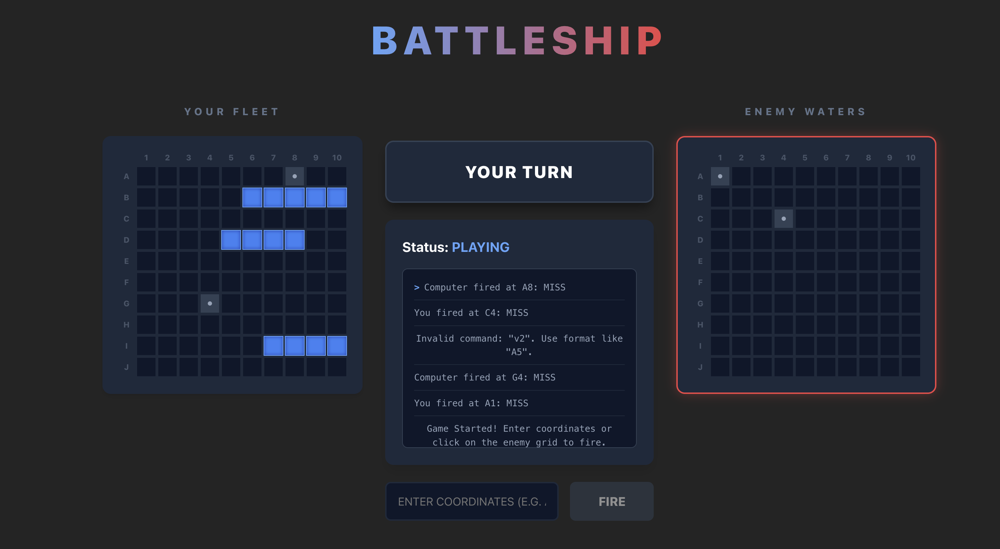
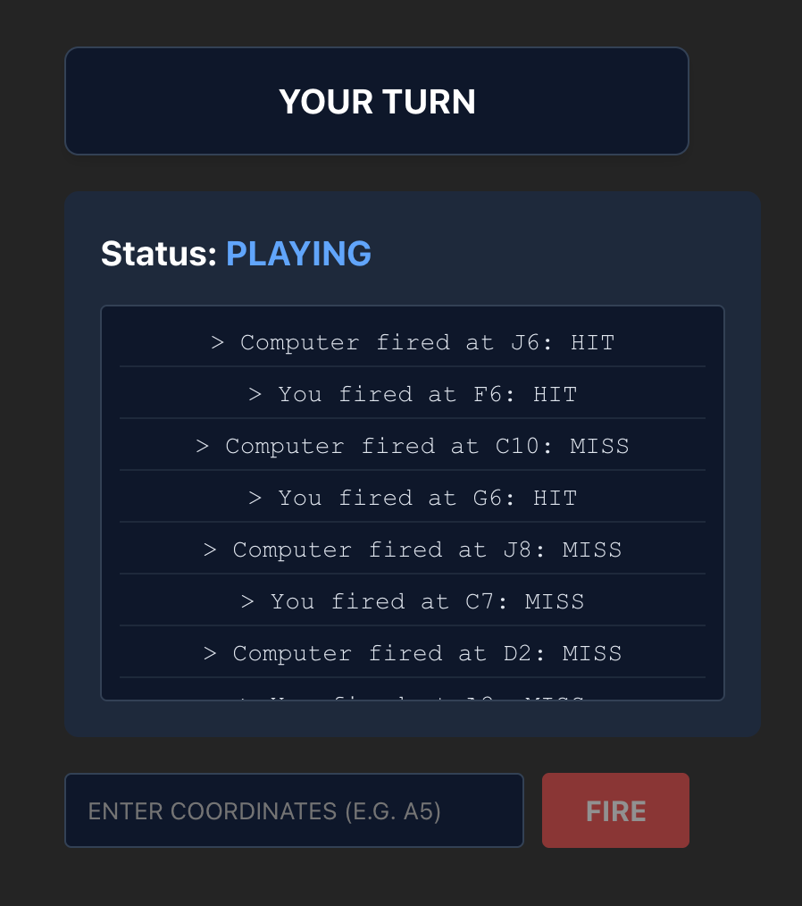
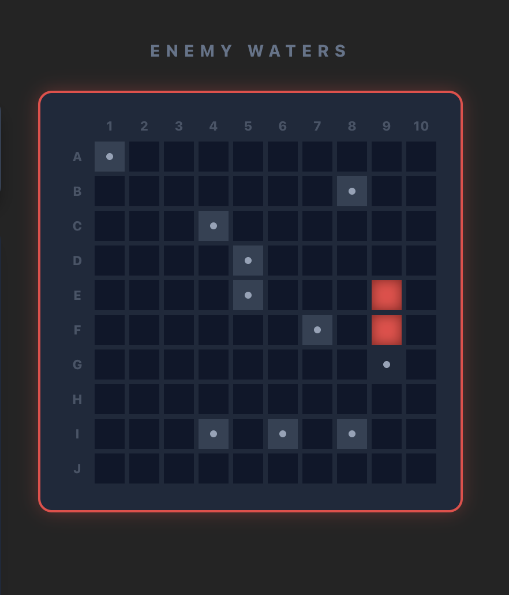
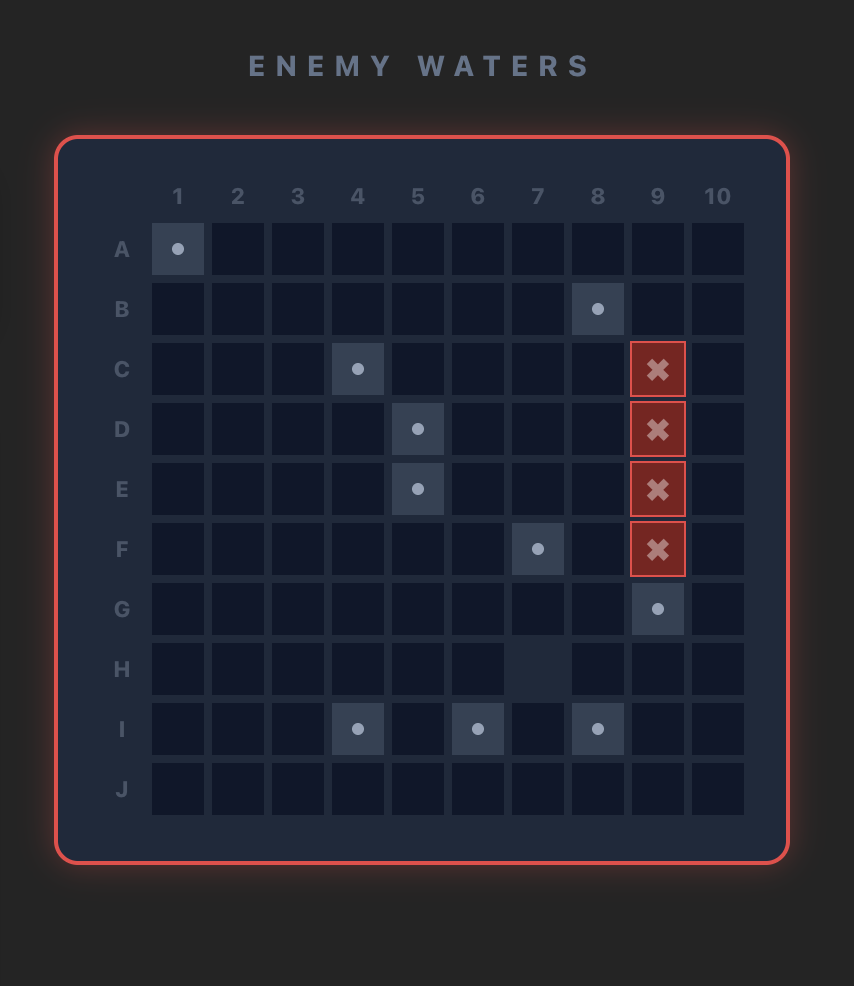
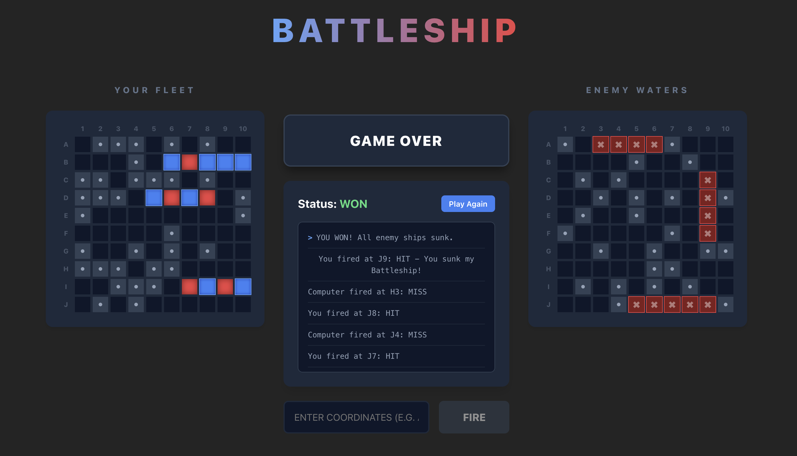
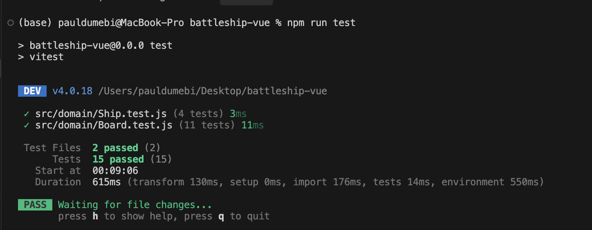

# Battleship Vue 3 Implementation

A modern, responsive, and functional implementation of the classic Battleship game using Vue 3, Vite, and Vitest. This project focuses on clean architecture, leveraging functional programming principles for core game logic and Vue 3 composables for state management.

## Install Dependencies

To set up the project locally, first install the necessary dependencies using npm:

```bash
npm install
```

This will install Vue 3, Vite, Vitest, and other development dependencies required to build and run the application.

## Serve the Application

Start the development server with the following command:

```bash
npm run dev
```

By default, the application will be accessible at `http://localhost:5173`. You can now play the game in your browser. The UI features a premium 3-column layout:

- **Left Column**: Your Fleet (Player Board)
- **Center Column**: Game Status, Turn Indicator, and Command Input
- **Right Column**: Enemy Waters (Computer Board)



To play the game, use the command input to fire at the enemy ships or click on the enemy waters to fire at the enemy ships. 



## Gameplay States

### 1. Scoring a HIT
A **HIT** occurs when you target a coordinate occupied by an enemy ship. In the UI, the cell will glow **Red** and a "HIT" message will appear in the game log. Use these hits to deduce the orientation and size of the hidden ship.



### 2. Sinking a Ship
A ship is **SUNK** once every cell it occupies has been hit. Sunk ships are marked with a distinct **Dark Red** color and a cross icon. The game will report exactly which class of ship you destroyed (e.g., "You sunk my Battleship!").



### 3. Victory & Game Over
The game ends when all ships in either fleet are sunk. If you neutralize the enemy fleet first, you achieve **Victory**. A game over status is displayed at the top, and you can restart the mission immediately.



## Running Test Cases

The core logic of the game is fully unit-tested using Vitest. To run the tests, use:

```bash
npm run test
```

This will execute the test suites for `Board.js` and `Ship.js`, verifying the functional integrity of the game mechanics.


---

## Core Features

### 1. Functional Game Logic

The core "Domain" of the game is built using pure functions and factory functions, ensuring predictable state transitions and easy testing.

- **`src/domain/Ship.js`**: Factory function for ships and pure functions for hitting and sinking logic.
- **`src/domain/Board.js`**: Functional board management including ship placement, attack reception, and coordinate parsing.

### 2. Vue 3 Composables

State management is decoupled from the UI components using custom composables:

- **`useBoard`**: Manages the reactive state of a single battleship board.
- **`useGame`**: Orchestrates the entire game flow, handling turns, AI logic, and win/loss states.

### 3. Dual Interaction Modes

Target the enemy fleet using two different methods:

- **Click-to-Fire**: Simply click any cell on the "Enemy Waters" grid to launch an attack.
- **Command Input**: Type coordinates (e.g., "A5", "C10") into the command box and click **FIRE**.

### 4. Responsive Design

The UI is built with a mobile-first mindset using modern CSS (Flexbox and Grid).

- **Desktop**: Side-by-side 3-column layout for a "command center" feel.
- **Mobile/Tablet**: Responsive wrapping ensures the game remains playable on smaller screens.

---

## Technical Stack

- **Framework**: [Vue.js 3](https://vuejs.org/) (Composition API)
- **Build Tool**: [Vite](https://vitejs.dev/)
- **Testing**: [Vitest](https://vitest.dev/)
- **Logic**: Pure Functional Programming
- **Styling**: Modern Vanilla CSS with CSS Variables
